### 📚 Về dự án - Web đọc truyện - VStory
   Dự án được clone một cách tối đa từ một web đọc truyện nổi tiếng, cung cấp nhiều tính năng cho người dùng 

### Tính năng chính
- Tìm kiếm truyện theo nhiều tiêu chí (số chapter, thời gian đăng, truyện hot hay không)
- Lưu lịch sử đọc truyện theo 2 cách: lưu lịch sử theo thiết bị (local storage) và lưu lịch sử theo tài khoản
- Chức năng kiếm xu bằng cách đăng nhập hàng ngày
- Xây dựng chức năng mua vật phẩm (mua khung avatar) để giữ chân người dùng
- Cung cấp API quản lý truyện, quản lý chapter, quản lý người dùng, ... và quản lý tệp ảnh trên cloud
- Xây dựng tính năng tính toán level bằng cách đọc truyện, có hiệu ứng tên khác biệt giữa các level
- Phân quyền theo vai trò, chỉ có admin mới có quyền đăng truyện tranh mới
- Tính năng bảng xếp hạng người dùng thúc đẩy người dùng ở lại trang web ( xếp người dùng theo số điểm và theo level)
- Các tính năng: quên mật khẩu, tùy chỉnh thông tin cá nhân
- Thực hiện kiểm tra xem người dùng đã đọc chapter chưa, nếu đọc rồi sẽ báo cho người đọc
- Dark - Light theme
- Chức năng bình luận
- Hệ thống alert rõ ràng

### Công việc ở frontend
- Dự án được viết bằng SCSS tuy nhiên việc quản lý CSS chưa tốt nên em quyết định refactor lại bằng Tailwind CSS
- Xử lý tình huống tái sử dụng class liên quan đến theme khá tốt bằng cách config biến taiwind css
- Tiến hành chia layout danh sách truyện rõ ràng, áp dụng nhuần nhuyễn các class taiwind để xây dựng UI responsive giao diện phức tạp với nhiều components
- Sử dụng framer motion để xây dựng hiệu ứng chuyển trang
- Xây dựng các fallback, loading, skeleton component khi đang chờ server gọi API
- Chú trọng, tỉ mỉ UI/UX, xây dựng các component có tính tái sử dụng như input, button và xây dựng chúng theo theme dark, light riêng
- Quản lý state toàn cục bằng Redux Toolkit
- Config axios gửi JWT kèm mỗi request lên server, khi JWT hết hạn, tự động gọi đến endpoint refresh JWT mới
- Sử dụng zod và react-hook-form để validate dữ liệu trước khi gửi
- Quản lý API theo loại tài nguyên tốt (ví dụ endpoint liên quan đến authentication đặt trong auth.js)
- Tối ưu việc call API bằng cách sử dụng kĩ thuật debounce
- Xử lý một số logic phức tạp liên quan đến UI như: việc cập nhật URL cũng thay đổi state kích hoạt của button
- Duy trì concept viết code với dự án có số lượng components lớn

## 🛠️ Công nghệ nổi bật
     React.js, Tailwind CSS v4, Redux Toolkit, React Query, zod, react-hook-form

## 🎬 Demo 

<table>
  <tr>
    <td>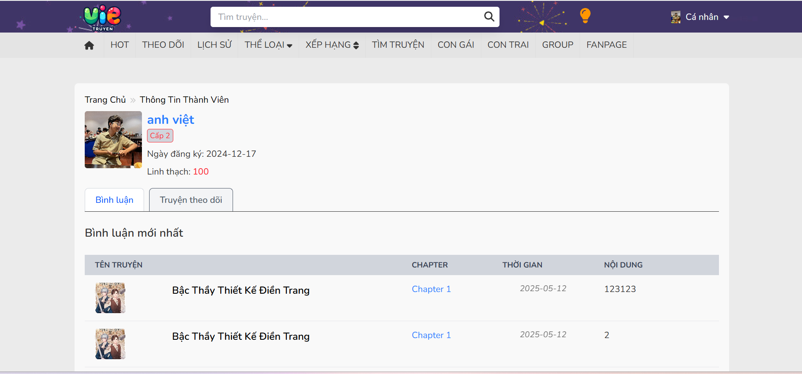</td>
    <td>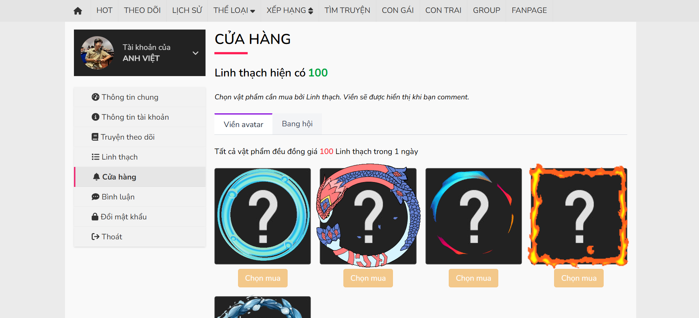</td>
  </tr>
  <tr>
    <td>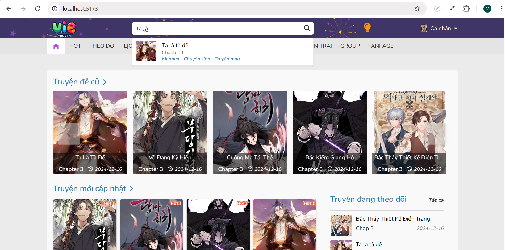</td>
    <td>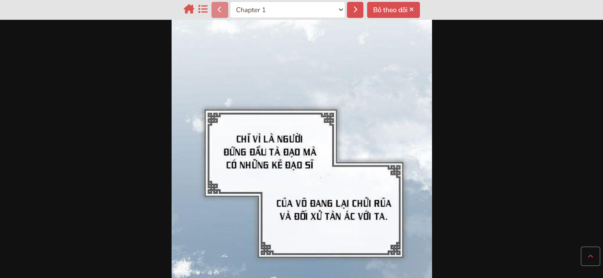</td>
  </tr>
  <tr>
    <td>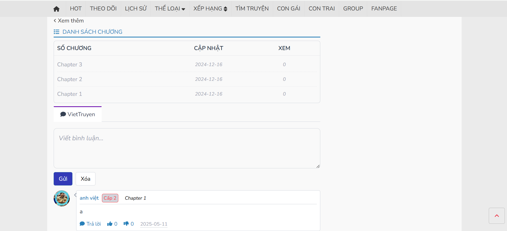</td>
    <td>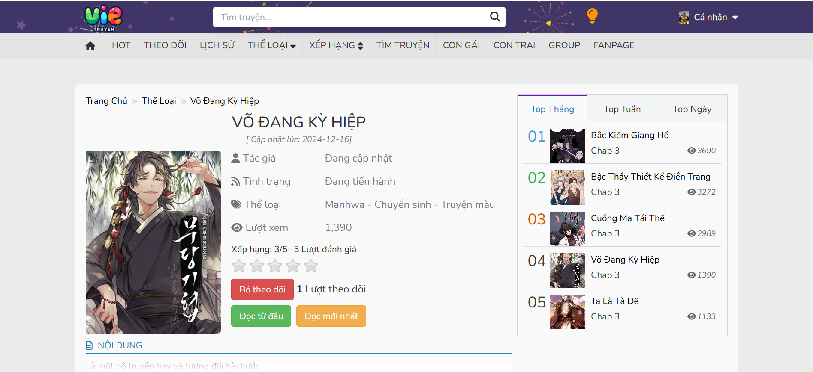</td>
  </tr>
  <tr>
    <td>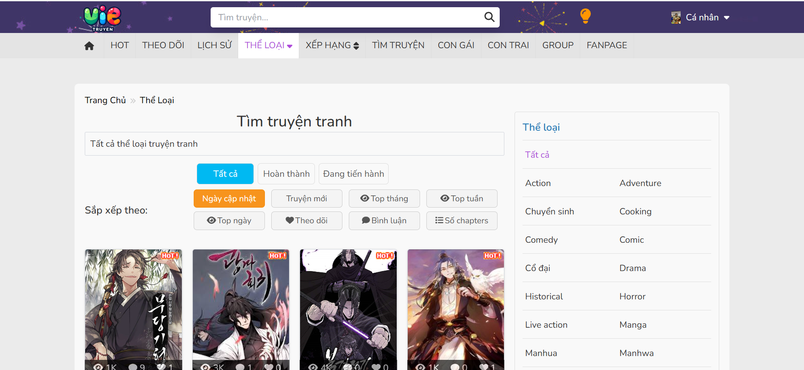</td>
    <td>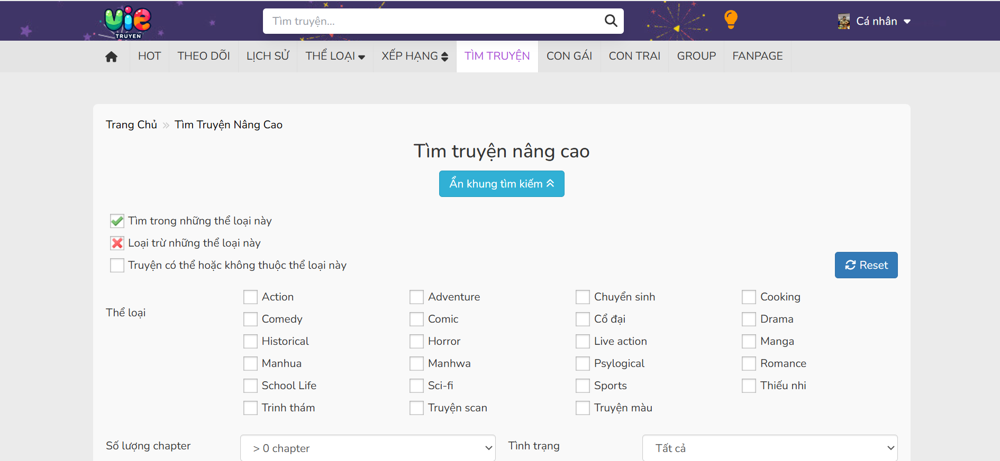</td>
  </tr>
  <tr>
    <td>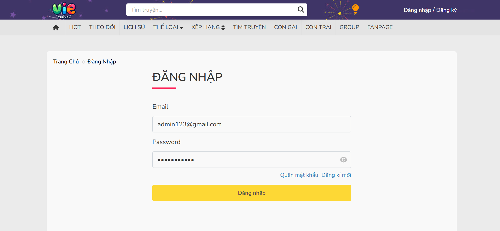</td>
    <td>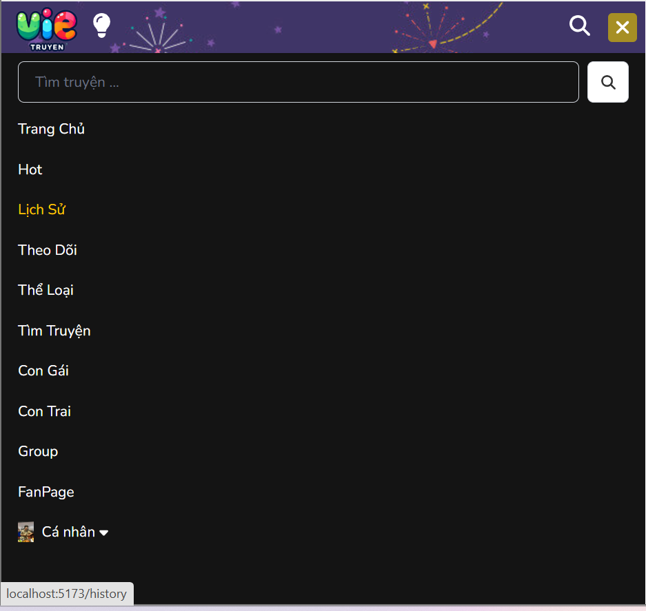</td>
  </tr>
  <tr>
    <td></td>
    <td>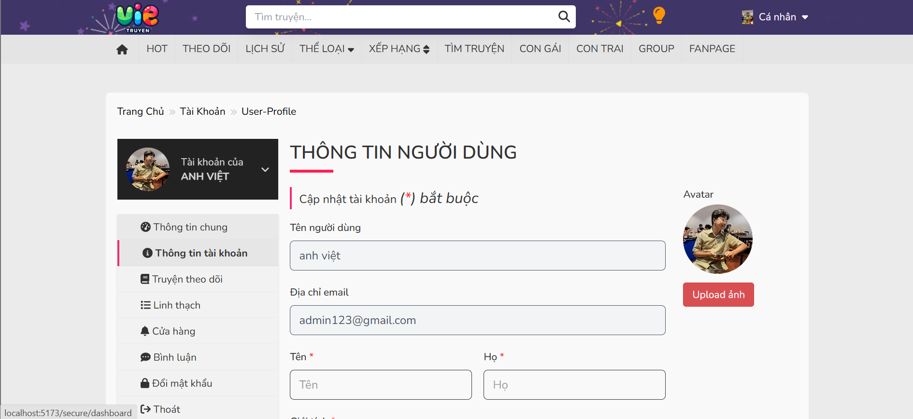</td>
  </tr>
  <tr>
    <td>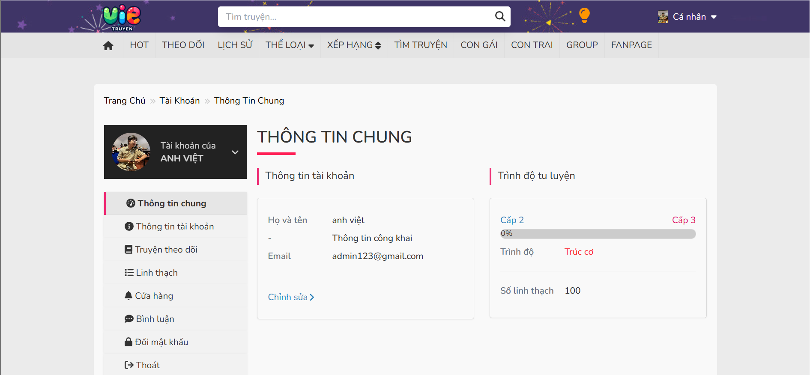</td>
    <td>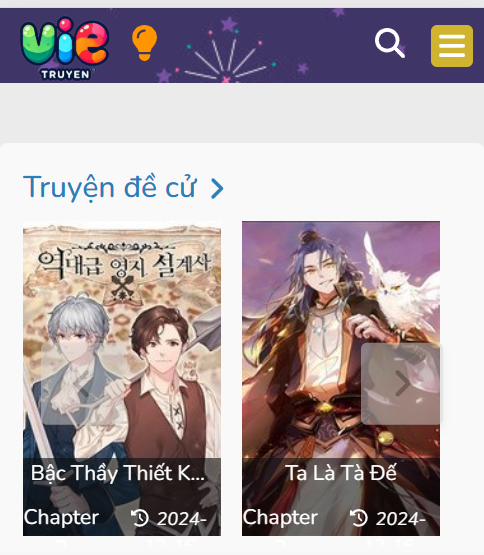</td>
  </tr>
  <tr>
    <td>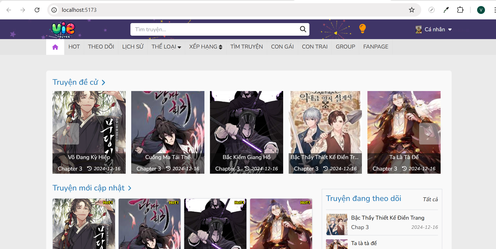</td>
  </tr>
</table>

### 📌Hướng Dẫn Cài Đặt và Chạy Dự Án

Để clone dự án từ GitHub về máy tính của bạn, làm theo các bước sau:

1. Mở terminal trong Visual Studio Code
   ```bash
   git clone https://github.com/helloVietTran/reading-story-web-fe
2. Di chuyển tới thư mục dự án
   ```bash
   cd reading-story-web-fe

3. chạy lệnh sau trong terminal visual studio code ở thư mục dự án 
     ```bash
     npm install
6. Để chạy dự án, chạy tiếp lệnh sau
     ```bash
     npm run dev
     ```
### 👤 Thông tin tài khoản test 
📌 Admin: tài khoản: admin123@gmail.com | mật khẩu: adminweb123

